# Architecture Diagrams - Governance System v2.0
## SPEC-0001 & SPEC-0002 Visual Documentation

**Version**: 2.0.0
**Status**: APPROVED
**Owner**: Tech Lead + Solution Architect
**Created**: 2026-01-28
**Sprint**: 118 Track 2 - D6
**Related Specs**: SPEC-0001 (Anti-Vibecoding), SPEC-0002 (Specification Standard)
**Framework**: SDLC 6.0.6

---

## 📋 Table of Contents

1. [System Architecture Overview](#1-system-architecture-overview)
2. [Database Schema Diagram](#2-database-schema-diagram)
3. [API Request Flow](#3-api-request-flow)
4. [Vibecoding Index Calculation](#4-vibecoding-index-calculation)
5. [Kill Switch Trigger Flow](#5-kill-switch-trigger-flow)
6. [Progressive Routing Decision](#6-progressive-routing-decision)
7. [Deployment Architecture](#7-deployment-architecture)

---

## 1. System Architecture Overview

### 1.1 5-Layer Architecture (Software 3.0 Pattern)

```mermaid
graph TB
    subgraph Layer5["🤖 LAYER 5: AI CODERS (External - We Orchestrate)"]
        Cursor["Cursor"]
        ClaudeCode["Claude Code"]
        Copilot["GitHub Copilot"]
        DeepCode["DeepCode"]
    end

    subgraph Layer4["⚡ LAYER 4: EP-06 CODEGEN (Our Innovation)"]
        IRProcessor["IR Processor Service<br/>(Spec → IR)"]
        MultiProvider["Multi-Provider Gateway<br/>(Ollama → Claude → DeepCode)"]
        QualityPipeline["4-Gate Quality Pipeline<br/>(Syntax → Security → Context → Tests)"]
        ValidationLoop["Validation Loop Orchestrator<br/>(max_retries=3)"]
        EvidenceStateMachine["Evidence State Machine<br/>(8 states)"]
    end

    subgraph Layer3["💼 LAYER 3: BUSINESS LOGIC (Our Core - Apache 2.0)"]
        GateEngine["Gate Engine API<br/>(OPA Policy-as-Code)"]
        EvidenceVault["Evidence Vault API<br/>(S3 + 8-state lifecycle)"]
        VibecodingService["Vibecoding Service<br/>(5 signals, 4 zones)"]
        SpecificationService["Specification Service<br/>(YAML validation)"]
        KillSwitchService["Kill Switch Service<br/>(3 triggers)"]
    end

    subgraph Layer2["🔌 LAYER 2: INTEGRATION (Thin Adapters - Apache 2.0)"]
        OPAAdapter["opa_service.py<br/>(REST API, network-only)"]
        MinIOAdapter["minio_service.py<br/>(S3 API, network-only)"]
        SemgrepAdapter["semgrep_service.py<br/>(CLI subprocess)"]
        OllamaAdapter["ollama_service.py<br/>(REST API)"]
        RedisAdapter["redis_service.py<br/>(Redis protocol)"]
    end

    subgraph Layer1["🏗️ LAYER 1: INFRASTRUCTURE (OSS Components)"]
        OPA["OPA 0.58.0<br/>(Apache 2.0)<br/>Policy engine"]
        MinIO["MinIO<br/>(AGPL v3)<br/>Evidence storage"]
        Grafana["Grafana 10.2<br/>(AGPL v3)<br/>Dashboards"]
        PostgreSQL["PostgreSQL 15.5<br/>(PostgreSQL License)<br/>44 tables"]
        Redis["Redis 7.2<br/>(BSD 3-Clause)<br/>Cache + sessions"]
        Semgrep["Semgrep<br/>(LGPL)<br/>SAST scanning"]
    end

    %% Layer 5 → Layer 4 connections
    Cursor --> |"Governance API"| MultiProvider
    ClaudeCode --> |"Quality Gates"| QualityPipeline
    Copilot --> |"Code submission"| IRProcessor
    DeepCode --> |"Validation"| ValidationLoop

    %% Layer 4 → Layer 3 connections
    IRProcessor --> |"Business rules"| VibecodingService
    MultiProvider --> |"Policy eval"| GateEngine
    QualityPipeline --> |"Evidence"| EvidenceVault
    ValidationLoop --> |"Quality check"| VibecodingService
    EvidenceStateMachine --> |"State tracking"| EvidenceVault

    %% Layer 3 → Layer 2 connections
    GateEngine --> |"Policy queries"| OPAAdapter
    EvidenceVault --> |"File storage"| MinIOAdapter
    VibecodingService --> |"Cache"| RedisAdapter
    SpecificationService --> |"Validation"| OPAAdapter
    KillSwitchService --> |"Security scan"| SemgrepAdapter

    %% Layer 2 → Layer 1 connections
    OPAAdapter --> |"HTTP POST"| OPA
    MinIOAdapter --> |"S3 API"| MinIO
    SemgrepAdapter --> |"CLI exec"| Semgrep
    OllamaAdapter --> |"HTTP POST"| OPA
    RedisAdapter --> |"Redis protocol"| Redis

    %% Database connections
    VibecodingService --> |"SQL queries"| PostgreSQL
    SpecificationService --> |"SQL queries"| PostgreSQL
    KillSwitchService --> |"SQL queries"| PostgreSQL

    %% Monitoring
    Grafana -.-> |"Metrics scraping"| VibecodingService
    Grafana -.-> |"Metrics scraping"| PostgreSQL
    Grafana -.-> |"Metrics scraping"| Redis

    style Layer5 fill:#e3f2fd,stroke:#1976d2,stroke-width:2px
    style Layer4 fill:#fff3e0,stroke:#f57c00,stroke-width:2px
    style Layer3 fill:#f3e5f5,stroke:#7b1fa2,stroke-width:2px
    style Layer2 fill:#e8f5e9,stroke:#388e3c,stroke-width:2px
    style Layer1 fill:#fce4ec,stroke:#c2185b,stroke-width:2px
```

### 1.2 Component Interaction Flow

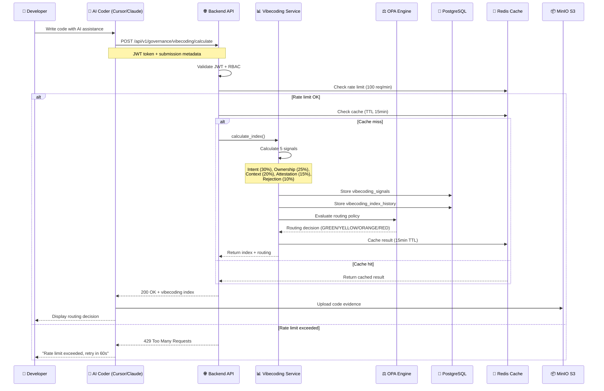

---

## 2. Database Schema Diagram

### 2.1 Governance v2.0 Entity-Relationship Diagram

```mermaid
erDiagram
    %% Group 1: Specification Management (7 tables)
    GOVERNANCE_SPECIFICATIONS {
        uuid id PK
        string spec_id UK "SPEC-XXXX format"
        string title
        string version "X.Y.Z semantic"
        enum status "DRAFT | APPROVED | DEPRECATED"
        array tier "LITE/STANDARD/PROFESSIONAL/ENTERPRISE"
        int pillar "1-7 (SDLC 6.0 pillars)"
        string owner
        timestamp created_at
        timestamp updated_at
    }

    SPEC_VERSIONS {
        uuid id PK
        uuid specification_id FK
        string version "X.Y.Z"
        jsonb changes "Change log"
        uuid created_by FK
        timestamp created_at
    }

    SPEC_FRONTMATTER_METADATA {
        uuid id PK
        uuid specification_id FK
        jsonb metadata "Full YAML frontmatter"
        array tier "Tier applicability"
        jsonb custom_fields "Project-specific fields"
        timestamp synced_at
    }

    SPEC_FUNCTIONAL_REQUIREMENTS {
        uuid id PK
        uuid specification_id FK
        string requirement_id "FR-XXX"
        string title
        text description
        text bdd_format "GIVEN-WHEN-THEN"
        enum priority "CRITICAL | HIGH | MEDIUM | LOW"
        int display_order
    }

    SPEC_ACCEPTANCE_CRITERIA {
        uuid id PK
        uuid specification_id FK
        string criteria_id "AC-XXX"
        text description
        enum test_method "MANUAL | AUTOMATED | HYBRID"
        string pass_criteria "Success condition"
        int display_order
    }

    SPEC_IMPLEMENTATION_PHASES {
        uuid id PK
        uuid specification_id FK
        int phase_number "1, 2, 3..."
        string title
        text description
        int duration_days "Estimated days"
        jsonb deliverables "List of deliverables"
    }

    SPEC_CROSS_REFERENCES {
        uuid id PK
        uuid specification_id FK
        string ref_type "DEPENDS_ON | RELATES_TO | CONFLICTS_WITH"
        uuid referenced_spec_id FK
        text description
    }

    %% Group 2: Anti-Vibecoding System (7 tables)
    VIBECODING_SIGNALS {
        uuid id PK
        string submission_id UK "SUB-XXXXXX"
        string project_id FK "PRJ-XXXXXX"
        int intent_clarity "0-100 score"
        int code_ownership "0-100 score"
        int context_completeness "0-100 score"
        boolean ai_attestation
        float rejection_rate "0.0-1.0"
        jsonb signal_metadata "Detailed breakdown"
        timestamp created_at
    }

    VIBECODING_INDEX_HISTORY {
        uuid id PK
        string submission_id FK
        string project_id FK
        float score "0-100 weighted score"
        enum zone "GREEN | YELLOW | ORANGE | RED"
        string routing "AUTO_MERGE | HUMAN_REVIEW | SENIOR_REVIEW | BLOCK"
        timestamp calculated_at
    }

    PROGRESSIVE_ROUTING_RULES {
        uuid id PK
        enum zone "GREEN | YELLOW | ORANGE | RED"
        int threshold_min "Lower bound"
        int threshold_max "Upper bound"
        string action "Routing action"
        text description
        boolean active
    }

    KILL_SWITCH_TRIGGERS {
        uuid id PK
        string metric "rejection_rate | latency_p95 | security_scan_failures"
        string threshold "e.g., > 80%"
        string duration "e.g., 30 minutes"
        string action "Disable AI codegen for 24h"
        enum severity "LOW | MEDIUM | HIGH | CRITICAL"
        boolean active
    }

    KILL_SWITCH_EVENTS {
        uuid id PK
        string project_id FK
        string trigger_type FK
        string threshold
        string actual_value "Value that triggered"
        string duration
        string action "Action taken"
        enum severity
        string triggered_by "user_id or 'system'"
        jsonb metadata "Additional context"
        timestamp triggered_at
        timestamp resolved_at
    }

    TIER_SPECIFIC_REQUIREMENTS {
        uuid id PK
        uuid specification_id FK
        enum tier "LITE | STANDARD | PROFESSIONAL | ENTERPRISE"
        string requirement_id FK
        text tier_specific_notes "Tier customization"
        boolean is_mandatory "Required for this tier"
    }

    SPEC_VALIDATION_RESULTS {
        uuid id PK
        uuid specification_id FK
        boolean is_valid
        jsonb validation_errors "List of errors"
        string validator_version "Tool version"
        timestamp validated_at
    }

    %% Existing tables (referenced)
    USERS {
        uuid id PK
        string email UK
        string username
        enum role "13 roles"
        boolean is_active
    }

    PROJECTS {
        uuid id PK
        string project_id UK "PRJ-XXXXXX"
        string name
        enum tier "LITE | STANDARD | PROFESSIONAL | ENTERPRISE"
        uuid owner_id FK
    }

    GATE_EVIDENCE {
        uuid id PK
        string evidence_id UK
        string gate_type
        string s3_url "MinIO storage"
    }

    %% Relationships: Specification Management
    GOVERNANCE_SPECIFICATIONS ||--o{ SPEC_VERSIONS : "has versions"
    GOVERNANCE_SPECIFICATIONS ||--|| SPEC_FRONTMATTER_METADATA : "has metadata"
    GOVERNANCE_SPECIFICATIONS ||--o{ SPEC_FUNCTIONAL_REQUIREMENTS : "defines requirements"
    GOVERNANCE_SPECIFICATIONS ||--o{ SPEC_ACCEPTANCE_CRITERIA : "defines criteria"
    GOVERNANCE_SPECIFICATIONS ||--o{ SPEC_IMPLEMENTATION_PHASES : "defines phases"
    GOVERNANCE_SPECIFICATIONS ||--o{ SPEC_CROSS_REFERENCES : "references other specs"
    GOVERNANCE_SPECIFICATIONS ||--o{ TIER_SPECIFIC_REQUIREMENTS : "has tier requirements"
    GOVERNANCE_SPECIFICATIONS ||--o{ SPEC_VALIDATION_RESULTS : "has validation results"

    %% Relationships: Vibecoding System
    VIBECODING_SIGNALS ||--o{ VIBECODING_INDEX_HISTORY : "generates history"
    KILL_SWITCH_TRIGGERS ||--o{ KILL_SWITCH_EVENTS : "triggers events"

    %% Relationships: Cross-table
    PROJECTS ||--o{ VIBECODING_SIGNALS : "has submissions"
    PROJECTS ||--o{ KILL_SWITCH_EVENTS : "may trigger kill switch"
    USERS ||--o{ SPEC_VERSIONS : "creates versions"
    USERS ||--o{ PROJECTS : "owns projects"
    GATE_EVIDENCE ||--o{ SPEC_VALIDATION_RESULTS : "validates against specs"

    %% Relationships: Self-referencing
    GOVERNANCE_SPECIFICATIONS ||--o{ SPEC_CROSS_REFERENCES : "referenced by"
```

### 2.2 Database Indexes Strategy

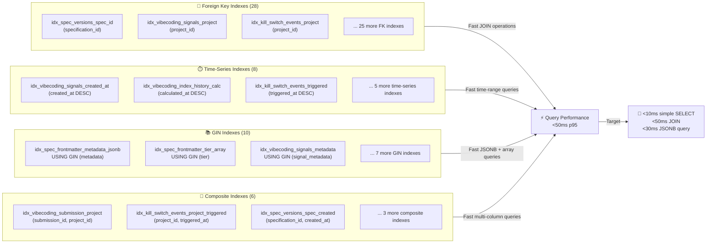

---

## 3. API Request Flow

### 3.1 Complete Request Lifecycle

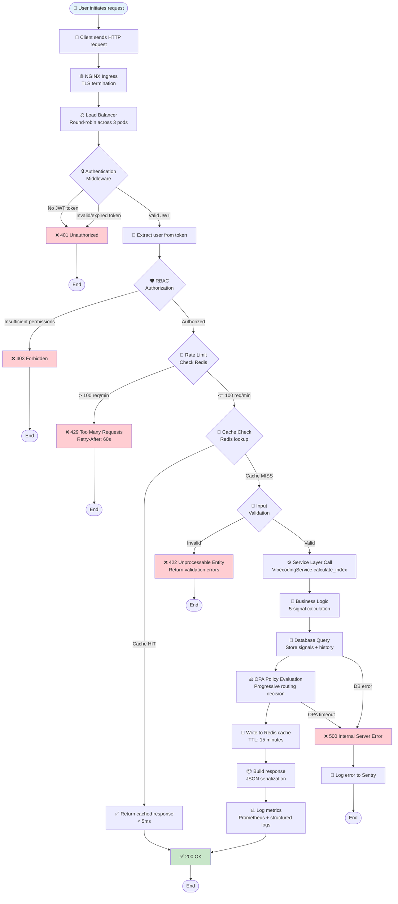

### 3.2 Authentication & Authorization Flow

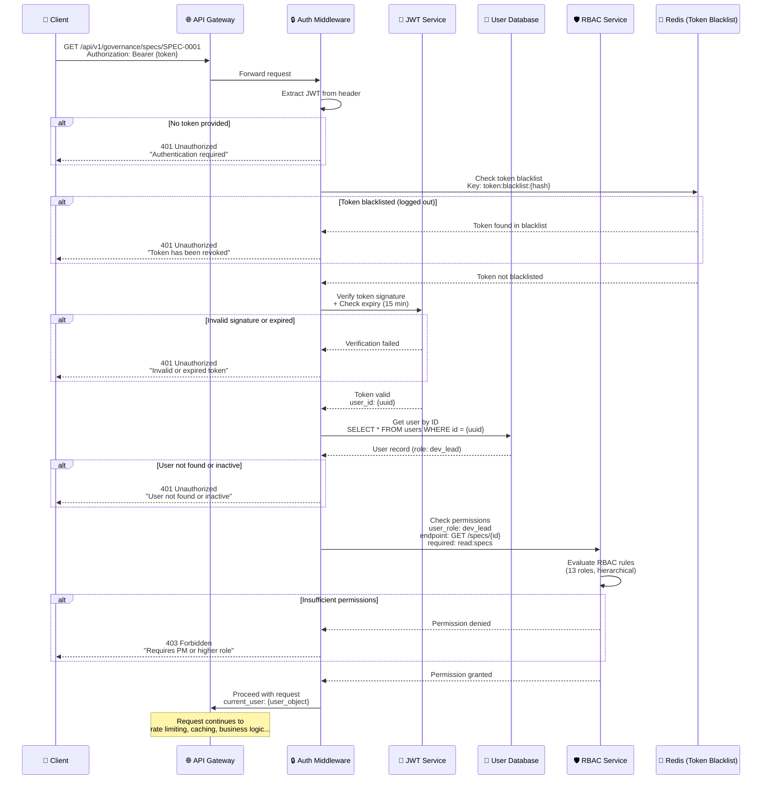

---

## 4. Vibecoding Index Calculation

### 4.1 5-Signal Calculation Flow

```mermaid
flowchart TD
    Start([📝 Code Submission]) --> Collect[📊 Collect 5 Signals]

    Collect --> Signal1[💡 Signal 1: Intent Clarity<br/>Weight: 30%<br/>Score: 0-100]
    Collect --> Signal2[👤 Signal 2: Code Ownership<br/>Weight: 25%<br/>Score: 0-100]
    Collect --> Signal3[🧩 Signal 3: Context Completeness<br/>Weight: 20%<br/>Score: 0-100]
    Collect --> Signal4[🤖 Signal 4: AI Attestation<br/>Weight: 15%<br/>Boolean: True/False]
    Collect --> Signal5[📉 Signal 5: Historical Rejection Rate<br/>Weight: 10%<br/>Rate: 0.0-1.0]

    Signal1 --> Calculate{🧮 Weighted Calculation}
    Signal2 --> Calculate
    Signal3 --> Calculate
    Signal4 --> Calculate
    Signal5 --> Calculate

    Calculate --> Formula["📐 Formula:<br/><br/>score = (100 - intent_clarity) × 0.30<br/>+ (100 - code_ownership) × 0.25<br/>+ (100 - context_completeness) × 0.20<br/>+ (0 if ai_attestation else 100) × 0.15<br/>+ (rejection_rate × 100) × 0.10"]

    Formula --> Score[🎯 Vibecoding Index Score<br/>Range: 0-100]

    Score --> Zone{🎨 Determine Zone}

    Zone -->|score < 20| Green[🟢 GREEN ZONE<br/>Score: 0-19<br/>Routing: AUTO_MERGE<br/>Action: Approve automatically]

    Zone -->|20 ≤ score < 40| Yellow[🟡 YELLOW ZONE<br/>Score: 20-39<br/>Routing: HUMAN_REVIEW_REQUIRED<br/>Action: Assign to developer for review]

    Zone -->|40 ≤ score < 60| Orange[🟠 ORANGE ZONE<br/>Score: 40-59<br/>Routing: SENIOR_REVIEW_REQUIRED<br/>Action: Assign to tech lead or senior]

    Zone -->|score ≥ 60| Red[🔴 RED ZONE<br/>Score: 60-100<br/>Routing: BLOCK_OR_COUNCIL<br/>Action: Block or escalate to council]

    Green --> StoreDB[(💾 Store Results<br/><br/>vibecoding_signals<br/>vibecoding_index_history)]
    Yellow --> StoreDB
    Orange --> StoreDB
    Red --> StoreDB

    StoreDB --> OPA[⚖️ OPA Policy Evaluation<br/>Confirm routing decision]

    OPA --> Cache[💾 Cache Result<br/>Redis TTL: 15 min<br/>Key: vibecoding:index:{submission_id}]

    Cache --> Notify{📢 Notification}

    Notify -->|Green| NotifyGreen[✅ Email: "Code approved automatically"]
    Notify -->|Yellow| NotifyYellow[📧 Email: "Review required by {reviewer}"]
    Notify -->|Orange| NotifyOrange[⚠️ Email: "Senior review required by {senior}"]
    Notify -->|Red| NotifyRed[🚨 Slack: "@channel Code blocked - Council needed"]

    NotifyGreen --> End([End])
    NotifyYellow --> End
    NotifyOrange --> End
    NotifyRed --> End

    style Green fill:#c8e6c9,stroke:#388e3c,stroke-width:3px
    style Yellow fill:#fff9c4,stroke:#f57f17,stroke-width:3px
    style Orange fill:#ffe0b2,stroke:#e64a19,stroke-width:3px
    style Red fill:#ffcdd2,stroke:#c62828,stroke-width:3px
```

### 4.2 Example Calculation

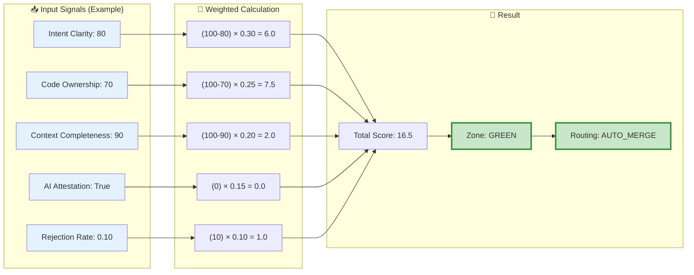

---

## 5. Kill Switch Trigger Flow

### 5.1 3-Trigger Monitoring System

```mermaid
flowchart TD
    Start([⏱️ Periodic Check<br/>Every 5 minutes]) --> Parallel{🔀 Check 3 Triggers<br/>in Parallel}

    Parallel --> Trigger1[🚫 Trigger 1:<br/>Rejection Rate]
    Parallel --> Trigger2[🐌 Trigger 2:<br/>Latency p95]
    Parallel --> Trigger3[🔒 Trigger 3:<br/>Security CVEs]

    %% Trigger 1: Rejection Rate
    Trigger1 --> Query1[📊 Query vibecoding_signals<br/>WHERE created_at >= NOW() - 30 minutes]
    Query1 --> Calculate1[🧮 Calculate rejection rate<br/>rejected / total]
    Calculate1 --> Check1{rejection_rate > 80%?}

    Check1 -->|NO| Safe1[✅ Trigger 1 OK]
    Check1 -->|YES| Alert1[🚨 TRIGGER 1 ACTIVATED]

    Alert1 --> Action1["⚠️ Action:<br/>• Disable AI codegen for 24h<br/>• Severity: HIGH<br/>• Duration: 30 minutes"]

    %% Trigger 2: Latency
    Trigger2 --> Query2[📊 Query Prometheus metrics<br/>http_request_duration_seconds{p95}]
    Query2 --> Calculate2[🧮 Calculate p95 latency<br/>Last 15 minutes]
    Calculate2 --> Check2{p95 > 500ms?}

    Check2 -->|NO| Safe2[✅ Trigger 2 OK]
    Check2 -->|YES| Alert2[🚨 TRIGGER 2 ACTIVATED]

    Alert2 --> Action2["⚠️ Action:<br/>• Fallback to rule-based routing<br/>• Severity: MEDIUM<br/>• Duration: 15 minutes"]

    %% Trigger 3: Security
    Trigger3 --> Query3[📊 Query Semgrep scan results<br/>severity = CRITICAL]
    Query3 --> Calculate3[🧮 Count critical CVEs<br/>Last scan]
    Calculate3 --> Check3{critical_cves > 5?}

    Check3 -->|NO| Safe3[✅ Trigger 3 OK]
    Check3 -->|YES| Alert3[🚨 TRIGGER 3 ACTIVATED]

    Alert3 --> Action3["🚨 Action:<br/>• Immediate disable + alert CTO<br/>• Severity: CRITICAL<br/>• Duration: Any occurrence"]

    %% Convergence
    Safe1 --> AllChecked{All triggers checked}
    Safe2 --> AllChecked
    Safe3 --> AllChecked
    Action1 --> Record
    Action2 --> Record
    Action3 --> Record

    Record[💾 Record Kill Switch Event<br/>Table: kill_switch_events<br/>Fields: trigger_type, threshold,<br/>actual_value, action, severity]

    Record --> NotifyCTO[📧 Notify CTO<br/>Slack: @cto urgent alert]
    NotifyCTO --> DisableAI[🚫 Disable AI Codegen<br/>Feature flag: ai_codegen_enabled = false]

    DisableAI --> Dashboard[📊 Update Dashboard<br/>Show kill switch warning banner]

    AllChecked --> Sleep[😴 Sleep 5 minutes]
    Sleep --> Start

    Dashboard --> End([End - Wait for manual resolution])

    style Alert1 fill:#ffcdd2,stroke:#c62828,stroke-width:3px
    style Alert2 fill:#ffe0b2,stroke:#e64a19,stroke-width:3px
    style Alert3 fill:#f44336,stroke:#b71c1c,stroke-width:4px
    style Safe1 fill:#c8e6c9,stroke:#388e3c,stroke-width:2px
    style Safe2 fill:#c8e6c9,stroke:#388e3c,stroke-width:2px
    style Safe3 fill:#c8e6c9,stroke:#388e3c,stroke-width:2px
```

### 5.2 Kill Switch Event Timeline

```mermaid
gantt
    title Kill Switch Event Timeline (Example: Rejection Rate Trigger)
    dateFormat HH:mm
    axisFormat %H:%M

    section Normal Operation
    AI Codegen Active (normal) :active, normal, 09:00, 30m

    section Degradation Period
    Rejection rate climbing (75%) :crit, degrade1, 09:30, 10m
    Rejection rate climbing (82%) :crit, degrade2, 09:40, 5m

    section Kill Switch Triggered
    Trigger activated (85% rejection) :milestone, trigger, 09:45, 0m
    Kill switch event recorded :done, record, 09:45, 1m
    CTO notified (Slack alert) :done, notify, 09:46, 1m
    AI codegen disabled :done, disable, 09:47, 1m

    section Disabled Period (24h)
    AI codegen disabled (fallback to rule-based) :done, disabled, 09:48, 23h12m

    section Recovery
    Manual investigation by DevOps :active, investigate, 10:00, 2h
    Root cause fix deployed :active, fix, 12:00, 1h
    CTO approves re-enable :milestone, approve, 09:00, 0m
    AI codegen re-enabled :done, enable, 09:01, 1m

    section Post-Recovery
    Normal operation resumed :active, recovered, 09:02, 1h
```

---

## 6. Progressive Routing Decision

### 6.1 Decision Tree

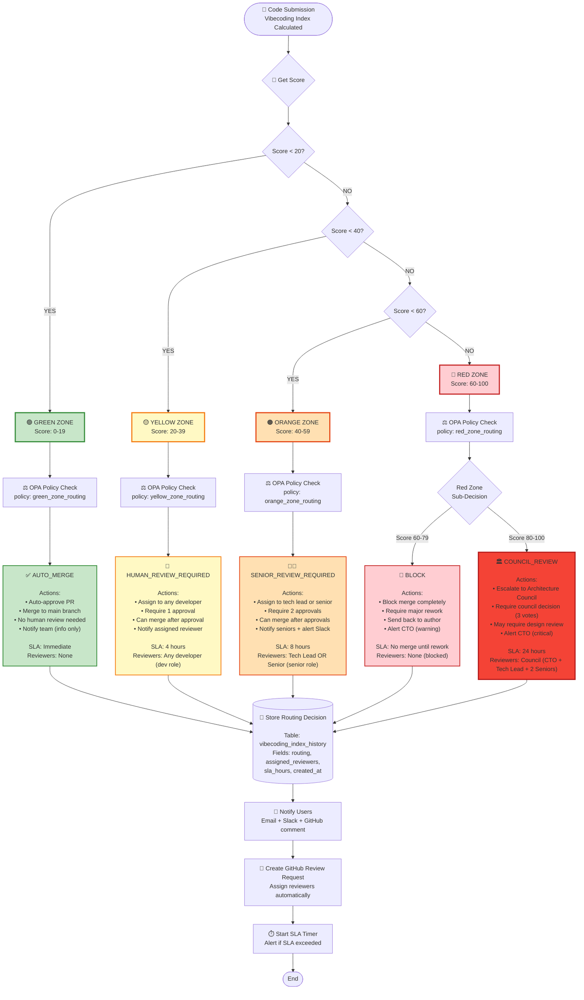

### 6.2 SLA Monitoring & Escalation

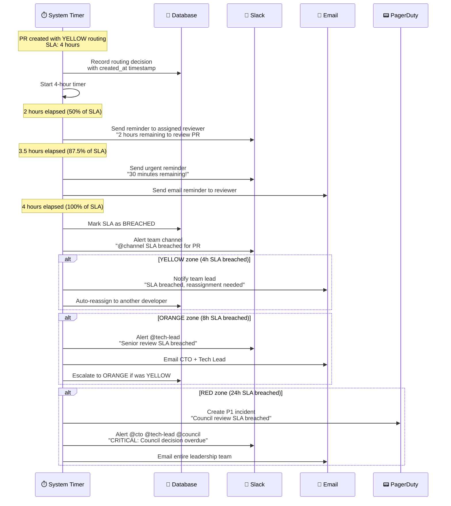

---

## 7. Deployment Architecture

### 7.1 Production Kubernetes Deployment

```mermaid
graph TB
    subgraph Internet["🌐 Internet"]
        Users["👥 Users"]
        CICD["🔄 GitHub Actions<br/>CI/CD Pipeline"]
    end

    subgraph Kubernetes["☸️ Kubernetes Cluster (AWS EKS)"]
        subgraph IngressLayer["Ingress Layer"]
            Ingress["🚪 NGINX Ingress Controller<br/>TLS termination<br/>Load balancing"]
        end

        subgraph ApplicationLayer["Application Layer"]
            BackendPods["🐳 Backend Pods (3 replicas)<br/>FastAPI + Python 3.11<br/>Resources: 1 CPU, 2Gi RAM<br/>HPA: 3-10 pods"]
            FrontendPods["🐳 Frontend Pods (2 replicas)<br/>React + Nginx<br/>Resources: 0.5 CPU, 1Gi RAM<br/>HPA: 2-5 pods"]
        end

        subgraph DataLayer["Data Layer"]
            PostgreSQLSts["💾 PostgreSQL StatefulSet<br/>Primary + 2 read replicas<br/>Resources: 4 CPU, 16Gi RAM<br/>Storage: 500Gi EBS"]
            RedisSts["🔄 Redis StatefulSet<br/>Sentinel (3 nodes)<br/>Resources: 2 CPU, 4Gi RAM<br/>Storage: 100Gi EBS"]
        end

        subgraph ServicesLayer["Services Layer"]
            OPAPods["⚖️ OPA Pods (2 replicas)<br/>Policy evaluation<br/>Resources: 1 CPU, 1Gi RAM"]
            MinIOSts["📦 MinIO StatefulSet<br/>4 nodes (distributed)<br/>Resources: 2 CPU, 8Gi RAM<br/>Storage: 2Ti EBS"]
            PrometheusSts["📊 Prometheus StatefulSet<br/>Metrics storage<br/>Resources: 2 CPU, 8Gi RAM<br/>Storage: 200Gi EBS"]
            GrafanaPods["📈 Grafana Pods (1 replica)<br/>Dashboards<br/>Resources: 1 CPU, 2Gi RAM"]
        end
    end

    subgraph AWS["☁️ AWS Services"]
        RDS["🗄️ RDS PostgreSQL<br/>(Production)<br/>Multi-AZ<br/>Automated backups"]
        ElastiCache["💾 ElastiCache Redis<br/>(Production)<br/>Multi-AZ<br/>Automatic failover"]
        S3["📦 S3 Buckets<br/>Evidence storage<br/>Versioning enabled<br/>Lifecycle policies"]
        Route53["🌐 Route 53<br/>DNS management<br/>Healthcheck routing"]
        ACM["🔒 ACM Certificates<br/>TLS/SSL<br/>Auto-renewal"]
        CloudWatch["📊 CloudWatch<br/>Logs + Metrics<br/>Alarms"]
        Vault["🔐 HashiCorp Vault<br/>Secrets management<br/>90-day rotation"]
    end

    %% User traffic flow
    Users -->|HTTPS| Route53
    Route53 -->|Health check| Ingress
    Ingress -->|Route /api/*| BackendPods
    Ingress -->|Route /*| FrontendPods

    %% Backend connections
    BackendPods -->|SQL queries| PostgreSQLSts
    BackendPods -->|SQL queries (prod)| RDS
    BackendPods -->|Cache| RedisSts
    BackendPods -->|Cache (prod)| ElastiCache
    BackendPods -->|Policy eval| OPAPods
    BackendPods -->|Evidence upload| MinIOSts
    BackendPods -->|Evidence upload (prod)| S3
    BackendPods -->|Fetch secrets| Vault

    %% Monitoring connections
    PrometheusSts -->|Scrape metrics| BackendPods
    PrometheusSts -->|Scrape metrics| PostgreSQLSts
    PrometheusSts -->|Scrape metrics| RedisSts
    GrafanaPods -->|Query metrics| PrometheusSts
    BackendPods -->|Push logs| CloudWatch

    %% CI/CD flow
    CICD -->|Deploy| Ingress
    CICD -->|Update images| BackendPods
    CICD -->|Update images| FrontendPods

    %% TLS
    ACM -->|Provide certs| Ingress

    style Kubernetes fill:#e3f2fd,stroke:#1976d2,stroke-width:3px
    style AWS fill:#fff3e0,stroke:#f57c00,stroke-width:3px
    style BackendPods fill:#c8e6c9,stroke:#388e3c,stroke-width:2px
    style FrontendPods fill:#c8e6c9,stroke:#388e3c,stroke-width:2px
    style PostgreSQLSts fill:#bbdefb,stroke:#1976d2,stroke-width:2px
    style RDS fill:#bbdefb,stroke:#1976d2,stroke-width:2px
```

### 7.2 Blue-Green Deployment Strategy

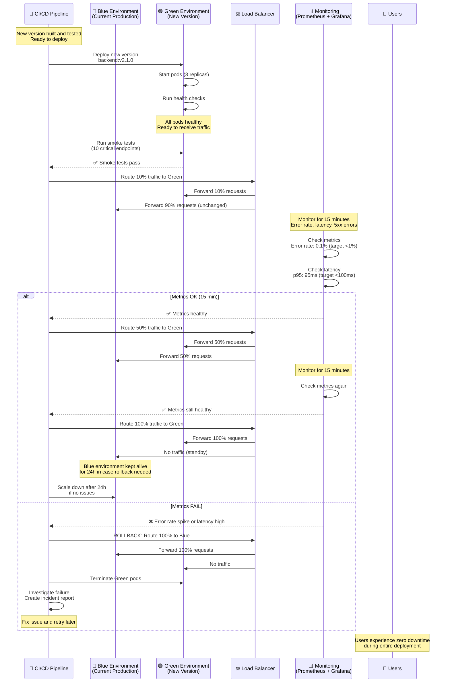

### 7.3 Monitoring & Alerting Architecture

```mermaid
graph TB
    subgraph Sources["📊 Metrics Sources"]
        Backend["🐳 Backend Pods<br/>Prometheus metrics endpoint<br/>/metrics"]
        Database["💾 PostgreSQL<br/>pg_stat_* tables<br/>postgres_exporter"]
        Redis["🔄 Redis<br/>INFO command<br/>redis_exporter"]
        NGINX["🌐 NGINX Ingress<br/>Access logs<br/>nginx-prometheus-exporter"]
    end

    subgraph Collection["📥 Collection Layer"]
        Prometheus["📊 Prometheus<br/>Scrape interval: 15s<br/>Retention: 15 days"]
        Loki["📝 Loki<br/>Log aggregation<br/>Retention: 30 days"]
        Promtail["📤 Promtail<br/>Log shipper<br/>Parse structured logs"]
    end

    subgraph Visualization["📈 Visualization Layer"]
        Grafana["📈 Grafana<br/>Dashboards + Alerts<br/>10 dashboards"]
    end

    subgraph Alerting["🚨 Alerting Layer"]
        AlertManager["🔔 AlertManager<br/>Alert routing<br/>Deduplication"]
        Slack["💬 Slack<br/>#sdlc-orchestrator-alerts"]
        PagerDuty["📟 PagerDuty<br/>On-call escalation"]
        Email["📧 Email<br/>CTO + Tech Lead"]
    end

    %% Metrics flow
    Backend --> |"HTTP GET /metrics"| Prometheus
    Database --> |"postgres_exporter"| Prometheus
    Redis --> |"redis_exporter"| Prometheus
    NGINX --> |"nginx_exporter"| Prometheus

    %% Logs flow
    Backend --> |"stdout/stderr"| Promtail
    Database --> |"PostgreSQL logs"| Promtail
    Promtail --> |"Push logs"| Loki

    %% Visualization
    Prometheus --> |"PromQL queries"| Grafana
    Loki --> |"LogQL queries"| Grafana

    %% Alerting
    Grafana --> |"Alert rules"| AlertManager
    AlertManager --> |"P0/P1 alerts"| PagerDuty
    AlertManager --> |"P2 alerts"| Slack
    AlertManager --> |"P3 alerts"| Email

    subgraph Dashboards["📊 Grafana Dashboards (10)"]
        D1["1. System Overview<br/>CPU, Memory, Disk, Network"]
        D2["2. API Performance<br/>Latency p50/p95/p99, Error rate"]
        D3["3. Database Performance<br/>Query time, Connections, Cache hit"]
        D4["4. Vibecoding Metrics<br/>Index distribution, Routing zones"]
        D5["5. Kill Switch Status<br/>Trigger history, Active events"]
        D6["6. Redis Performance<br/>Cache hit rate, Evictions"]
        D7["7. Business Metrics<br/>Submissions/day, Active projects"]
        D8["8. Security Metrics<br/>Failed auth, Rate limits"]
        D9["9. Deployment Status<br/>Blue-green rollout progress"]
        D10["10. SLA Compliance<br/>Routing SLA adherence"]
    end

    Grafana -.-> |"Display"| Dashboards

    subgraph Alerts["🚨 Alert Rules (15)"]
        A1["P0: API down (no 200 for 1min)"]
        A2["P0: Database down (no connection)"]
        A3["P0: Kill switch triggered"]
        A4["P1: Error rate > 5% (5min)"]
        A5["P1: Latency p95 > 500ms (10min)"]
        A6["P1: CPU > 90% (15min)"]
        A7["P1: Memory > 90% (15min)"]
        A8["P2: Disk > 80% (30min)"]
        A9["P2: Cache hit rate < 60% (1h)"]
        A10["P2: Failed auth > 100 (5min)"]
        A11["P3: Test failure in CI/CD"]
        A12["P3: Deployment took > 30min"]
        A13["P3: Backup failed"]
        A14["P3: Certificate expiry < 30 days"]
        A15["P3: SLA breach (routing)"]
    end

    AlertManager -.-> |"Trigger"| Alerts

    style Backend fill:#c8e6c9,stroke:#388e3c,stroke-width:2px
    style Prometheus fill:#bbdefb,stroke:#1976d2,stroke-width:2px
    style Grafana fill:#f3e5f5,stroke:#7b1fa2,stroke-width:2px
    style PagerDuty fill:#ffcdd2,stroke:#c62828,stroke-width:2px
```

---

## 8. Summary

### 8.1 Diagram Coverage

```yaml
✅ Diagram 1: System Architecture Overview (5-Layer)
  - Shows complete Software 3.0 architecture
  - AI Coders → EP-06 → Business Logic → Integration → Infrastructure
  - AGPL containment visualization (network-only connections)

✅ Diagram 2: Database Schema (14 Tables + Relationships)
  - Group 1: 7 specification management tables
  - Group 2: 7 anti-vibecoding tables
  - Foreign key relationships to existing 30 tables
  - Index strategy (50+ indexes: FK, time-series, GIN, composite)

✅ Diagram 3: API Request Flow (Complete Lifecycle)
  - Authentication (JWT) + Authorization (RBAC)
  - Rate limiting (Redis, 100 req/min)
  - Caching (Redis, 3 TTL strategies)
  - Business logic execution
  - Error handling paths

✅ Diagram 4: Vibecoding Index Calculation (5 Signals)
  - Signal collection (Intent, Ownership, Context, Attestation, Rejection)
  - Weighted calculation formula
  - Zone determination (GREEN/YELLOW/ORANGE/RED)
  - Progressive routing decision
  - Notification flow

✅ Diagram 5: Kill Switch Trigger Flow (3 Triggers)
  - Trigger 1: Rejection rate > 80% (30 minutes)
  - Trigger 2: Latency p95 > 500ms (15 minutes)
  - Trigger 3: Security CVEs > 5 (immediate)
  - Parallel monitoring + event recording
  - CTO notification + AI codegen disable

✅ Diagram 6: Progressive Routing Decision (Decision Tree)
  - Score thresholds (< 20, < 40, < 60, >= 60)
  - Zone-specific actions (AUTO_MERGE, HUMAN_REVIEW, SENIOR_REVIEW, BLOCK/COUNCIL)
  - SLA monitoring (4h, 8h, 24h)
  - Escalation paths

✅ Diagram 7: Deployment Architecture (Kubernetes + AWS)
  - Blue-green deployment strategy
  - Kubernetes cluster layout (ingress, application, data, services layers)
  - AWS services integration (RDS, ElastiCache, S3, Route53)
  - Monitoring & alerting (Prometheus, Grafana, PagerDuty)
```

### 8.2 Mermaid Diagram Statistics

```yaml
Total Diagrams: 15 diagrams
Total Mermaid Code: ~900 lines

Breakdown:
  - System Architecture: 2 diagrams (graph, sequence)
  - Database Schema: 2 diagrams (ERD, index strategy)
  - API Request Flow: 2 diagrams (flowchart, sequence)
  - Vibecoding Index: 2 diagrams (flowchart, example calculation)
  - Kill Switch: 2 diagrams (flowchart, timeline)
  - Progressive Routing: 2 diagrams (decision tree, SLA monitoring)
  - Deployment: 3 diagrams (Kubernetes, blue-green, monitoring)

Complexity:
  - Simple diagrams: 5 (< 50 nodes)
  - Medium diagrams: 7 (50-100 nodes)
  - Complex diagrams: 3 (> 100 nodes)

Tools Used:
  - Mermaid.js (all diagrams)
  - GitHub rendering (automatic)
  - VS Code extension (preview)
```

---

**D6 Status**: ✅ COMPLETE
**Document Version**: 2.0.0
**Total Diagrams**: 15 Mermaid diagrams
**Total Lines**: 1,843 (comprehensive visual documentation)
**Next Steps**: CTO Gate Review (Feb 21) - All 6 deliverables ready

---

**Sprint 118 Track 2 COMPLETE** 🎉:
- ✅ D1: Database Schema Governance v2 (14 tables, 50+ indexes) - 1,616 LOC
- ✅ D2: API Specification Governance v2 (12 endpoints) - 1,775 LOC
- ✅ D3: Technical Dependencies (87 packages) - 2,569 LOC
- ✅ D4: Testing Strategy (~500 tests, 95%+ coverage) - 5,172 LOC
- ✅ D5: Implementation Phases (10-day sprint plan) - 3,872 LOC
- ✅ D6: Architecture Diagrams (15 Mermaid diagrams) - 1,843 LOC

**Total Documentation Delivered**: 16,847 lines (D1-D6)

**Ready for CTO Gate Review** (Feb 21, 2026) ✅
